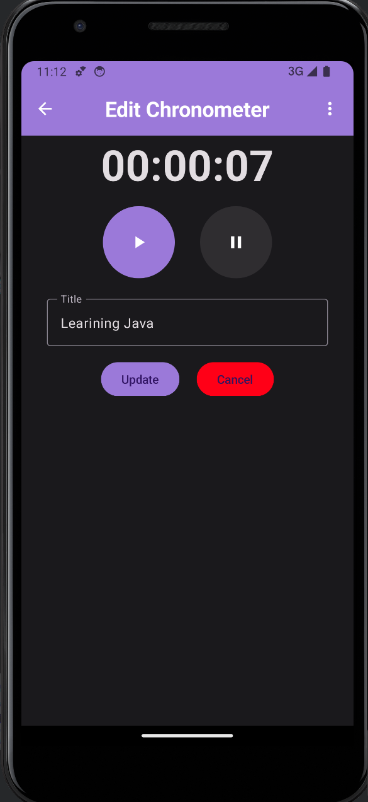
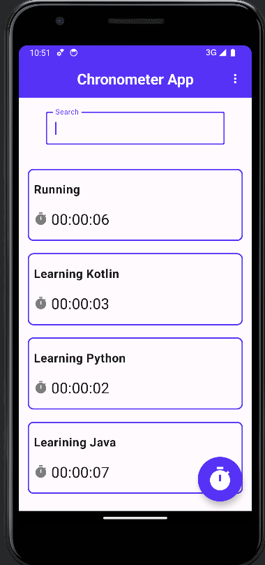

  

<h3 align="center">Chronometer App</h3>

## 📝 Table of Contents

- [About](#about)
- [Getting Started](#getting_started)
- [Usage](#usage)
- [Built Using](#built_using)
- [Authors](#authors)

## 🧐 About 

Chronometer app allows you to use a chronometer and store the time with a label to keep track of the time takes you to do activities such as: cooking a cake, running 1km, solving a leetcode problem, etc.

## 🏁 Getting Started 

* Install Android Studio, which will help you to setup the environment to run the application.
* Clone this repository to you computer.
* Open the project in Android Studio.
* Run the app

### Prerequisites

- Gradle
- Android Studio
- Kotlin SDK

## 🎈 Usage 

### Home screen

In the home screen you will find the list of the chronometers you have saved and a floating button, which is used to navigate to the timer screen.

The home screen includes a search bar to find a specific timer by its label.

If you want to delete a timer, you just need to swipe the timer to the left and it will be deleted.

If you want to edit a timer, you just need to swipe the timer the right and will open the edit timer view.

### Timer screen

In the timer screen you will find a timer with four buttons (Play, Pause, Stop and Save).

If you want to make the timer run, you will press the play button.
Once you pressed the play button, the timer will start to run, and the Pause button will be enabled.

If you want to pause the timer, press the Pause button and the Stop, Play and Save button will be enabled.

* The play button will start the timer again 
* The Stop button will set the timer to 00:00:00
* The Save button will display a textfield to label the timer and save it.

### Preferences menu

The chronometer counts with a preferences menu, which is useful to select if you want to see the app in Dark mode or Light mode. It also has an option to see the app in the Color blindness mode (Light and Dark Mode).

#### Light mode

#### Dark mode

## ⛏️ Built Using 

- [Room](https://developer.android.com/training/data-storage/room/) - Database
- [Jetpack Compose](https://developer.android.com/jetpack/compose) - UI
- [Kotlin](https://kotlinlang.org/) - Server Environment
- [Dagger Hilt](https://dagger.dev/hilt/) - Dependency Injection
- [DataStore](https://developer.android.com/jetpack/androidx/releases/datastore) - Preferences Storage

## ✍️ Authors 

- [@EdgarRamirezFuentes](https://github.com/EdgarRamirezFuentes)
